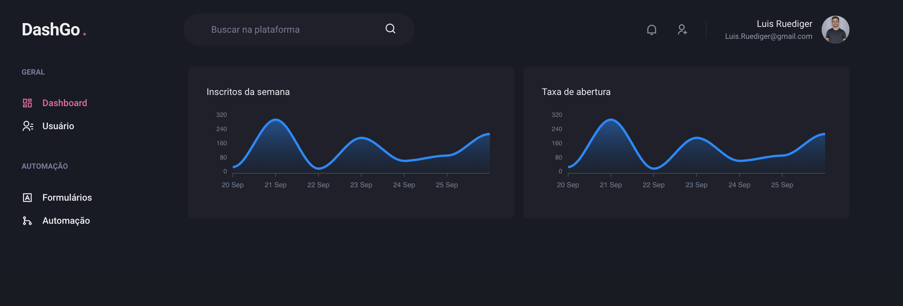
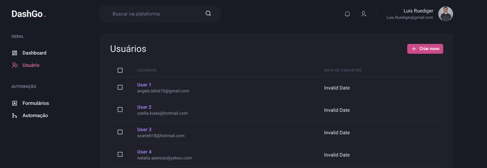

# DashGo.

Projeto Dashgo. é uma aplicação simples de dashboard, criado para aprender conceitos do ChackraUI. Desenvolvido durante o Ignite @Rocketseat.  
> Para ver o projeto rodando você pode acessar este [Link]().

---

  
  

---
## Funcionalidades

- [x] Criação de usuários

---

## Tecnologias

- [ReactJS](https://reactjs.org/)
- [TypeScript](https://www.typescriptlang.org/)
- [Chakra UI](https://chakra-ui.com/)
- [Next.js](https://nextjs.org/)
- [React Hook Form](https://react-hook-form.com/)
- [React Query](https://react-query.tanstack.com/)
- [Mirage JS](https://miragejs.com/)

